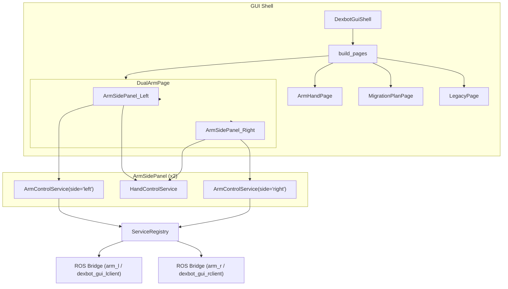

```mermaid
graph TD
    subgraph "GUI Shell"
        DexbotGuiShell --> build_pages
        build_pages --> ArmHandPage
        build_pages --> DualArmPage
        build_pages --> MigrationPlanPage
        build_pages --> LegacyPage
    end

    subgraph "DualArmPage"
        DualArmPage --> ArmSidePanel_Left
        DualArmPage --> ArmSidePanel_Right
    end

    subgraph "ArmSidePanel (x2)"
        ArmSidePanel_Left --> ArmControlService_L["ArmControlService(side='left')"]
        ArmSidePanel_Left --> HandControlService
        ArmSidePanel_Right --> ArmControlService_R["ArmControlService(side='right')"]
        ArmSidePanel_Right --> HandControlService
    end

    ArmControlService_L --> ServiceRegistry
    ArmControlService_R --> ServiceRegistry

    ServiceRegistry --> bridge_l["ROS Bridge (arm_l / dexbot_gui_lclient)"]
    ServiceRegistry --> bridge_r["ROS Bridge (arm_r / dexbot_gui_rclient)"]
```
