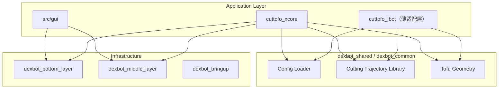

# Refactoring Architecture Plan

## Overview

对 dexbot_ros2_ws 代码库进行系统重构，按 4 个阶段逐步推进，每阶段可独立验证。

## Current Codebase State

```text
src/
├── dexbot_bottom_layer/    # 底层硬件控制 (xCore SDK, Lbot C API, 灵巧手)
├── dexbot_interfaces/      # ROS 接口定义 (low/mid/tool)
├── dexbot_middle_layer/    # 感知管线 (SAM3, pose estimation, CutTofo 遗留)
├── dexbot_high_layer/      # 切黄瓜遗留代码
├── dexbot_bringup/         # launch 文件
├── dexbot_toolbox/         # 工具 (标定, GUI, metrics, visualization)
├── cuttofo_xcore/          # 切豆腐主线 (状态机 + 切割动作)
├── cuttofo_lbot/           # 切豆腐 Lbot 版
├── cuttofo_calibration/    # ChArUco 标定
├── cuttofo_lbot_interfaces/ # Lbot 接口定义
├── gui/                    # 当前活跃 GUI
├── gui_backup/             # 备份 GUI (待清理)
├── config/ config1/        # 配置文件 (待统一)
├── ar5_*_description/      # URDF 描述
├── linkerhand-*_description/ # 灵巧手 URDF
└── scripts/ tools/         # 辅助脚本
```

## Phase Plan

### Phase 1: Cleanup (清理)

**目标**: 消除干扰项，让代码库只反映活跃代码。

| Step | Action | Risk |
|------|--------|------|
| 1.1 | 删除 `gui_backup/` | Low - git 历史可恢复 |
| 1.2 | 确认 `CutTofo/sdk/` 活跃状态，归档不用的 SDK 脚本 | Medium - 需确认引用 |
| 1.3 | 确认 `dexbot_high_layer/` 状态，归档切黄瓜遗留 | Low - 与主线无关 |
| 1.4 | 统一散落的配置文件目录 | Low |

**预计减少**: ~30-40% 的代码量（主要在备份和遗留代码）

### Phase 2: Extract Shared Abstractions (提取共享)

**目标**: 消除重复代码，核心逻辑只有唯一实现。

| Step | Action | Risk |
|------|--------|------|
| 2.1 | 从 `cuttofo_xcore/config_loader.py` 提取为独立共享包 `dexbot_shared/config.py` | Low |
| 2.2 | 从 `cuttofo_xcore/cut_trajectory.py` 和 `tofu_geometry.py` 提取共享切割库 | Medium |
| 2.3 | 统一 3 份切豆腐逻辑的公共部分 | High - 需仔细对比行为 |
| 2.4 | 统一 GUI 的 ArmControlService 接口 | Medium |

**原则**: 不改现有调用方，先"加不删"，原文件改为 import 转发。

### Phase 3: Split Monoliths (拆分大文件)

**目标**: 把超过 1000 行的大文件拆成职责单一的模块。

| File | Lines | Split Strategy |
|------|-------|---------------|
| `xcore_follow_tcp_chain_node_movej.py` | 6268 | node.py + chain_planner.py + tcp_math.py + config.py |
| `arm_hand_gui.py` | 3482 | 按 tab/page 拆分 |
| `xcore_controller_node.py` | 1939 | node.py + motion.py + config.py |
| `hand_eye_calibration_node.py` | 2511 | node.py + algorithm.py + io.py |
| `demo_cut_smooth_pro.py` | 3339 | 如仍在用则拆分，否则归档 |

**方法**: 新建模块目录 -> 复制代码 -> 原文件保留 import 转发 -> 稳定后删除原文件

### Phase 4: Add Tests (补充测试)

**目标**: 关键路径有冒烟测试覆盖，为后续修改提供安全网。

| Priority | Module | Test Type |
|----------|--------|-----------|
| P0 | `cuttofo_xcore` 核心节点 | 冒烟 (import + instantiate) |
| P1 | `tofu_geometry`, `cut_trajectory` | 单元测试 |
| P2 | `config_loader` | 单元测试 |
| P3 | `xcore_arm_adapter` | 冒烟 |
| P4 | `phase_manager_node` | 状态转换测试 |

## Architecture Diagram (Target State)



## Notes

- 本计划是重构架构的总纲，具体细节在 `business-logic/` 下分阶段记录
- 每个阶段的具体操作计划记录在对应的 branch 文件中
