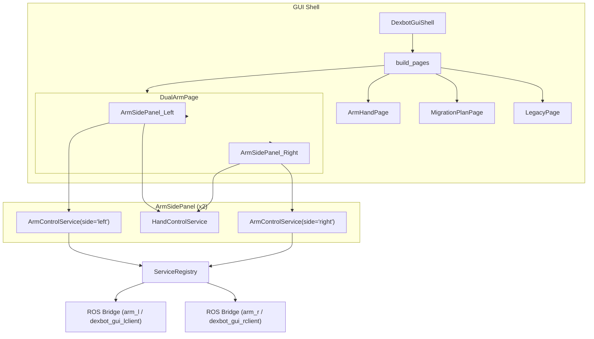

# Business Logic Graph

## Main (GUI - existing)



## Main (Refactoring - added)

```text
CodeBaseCurrentState -> Phase1_Cleanup -> Phase2_ExtractShared -> Phase3_SplitMonoliths -> Phase4_AddTests
```

## Details

### CodeBaseCurrentState

Current state: 540+ Python files, ~131K LOC, 34+ ROS packages, 6+ monolith files >1000 lines.

### Phase1_Cleanup

Sub-path:
```text
CodeBaseCurrentState
  -> Delete_gui_backup
  -> Archive_CutTofo_sdk (pending verification Q-20260526-001)
  -> Archive_dexbot_high_layer (pending verification Q-20260526-002)
  -> Consolidate_config_dirs
  -> CodeBaseCleaned
```

### Phase2_ExtractShared

Sub-path:
```text
CodeBaseCleaned
  -> Extract_config_loader_to_shared
  -> Extract_cut_trajectory_to_shared
  -> Extract_tofu_geometry_to_shared
  -> Unify_cut_tofu_implementations
  -> SharedAbstractionsReady
```

### Phase3_SplitMonoliths

Sub-path:
```text
SharedAbstractionsReady
  -> Split_follow_tcp_chain (6268 lines)
  -> Split_arm_hand_gui (3482 lines)
  -> Split_hand_eye_calibration (2511 lines)
  -> Split_xcore_controller (1939 lines)
  -> MonolithsSplit
```

### Phase4_AddTests

Sub-path:
```text
MonolithsSplit
  -> Add_cuttofo_xcore_smoke_tests
  -> Add_geometry_unit_tests
  -> Add_adapter_smoke_tests
  -> RefactoringComplete
```

## Branches

- None yet (refactoring branches will be added when exploring alternatives)

## Archived

- Refactoring will archive: `gui_backup/`, unused `CutTofo/sdk/` scripts, unused `dexbot_high_layer/` code
